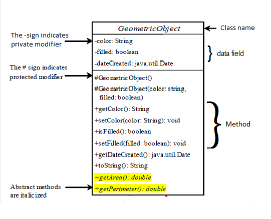
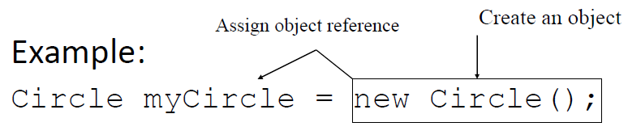
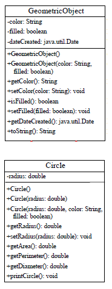

# Revision on OOP

### **Topic** 

#### -Class & Object

#### -Inheritance (Superclasses and Subclasses)

#### -Overriding vs. Overloading

#### Polymorphism

#### -Abstract Class and Method

#### -Interface

# Class & Object

#### UML Diagram = Unified Modeling Language

####

#### Creating Objects and object reference

#### 

# Inheritance

#### Superclass

syntax: super(parameters) can pull parameters(data field) from another class

``public Circle (double radius, String color, boolean filled){`

`super(color,filled);`

`this.radius= radius;`

`}`

